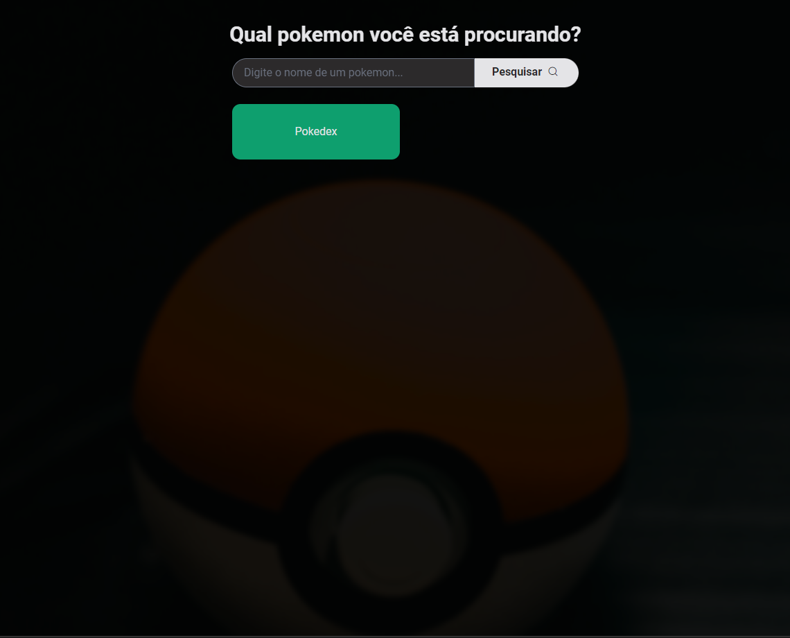
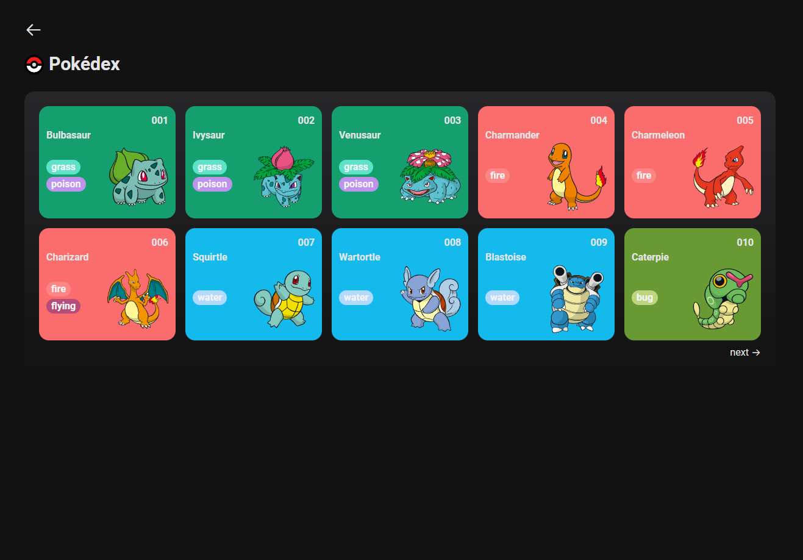
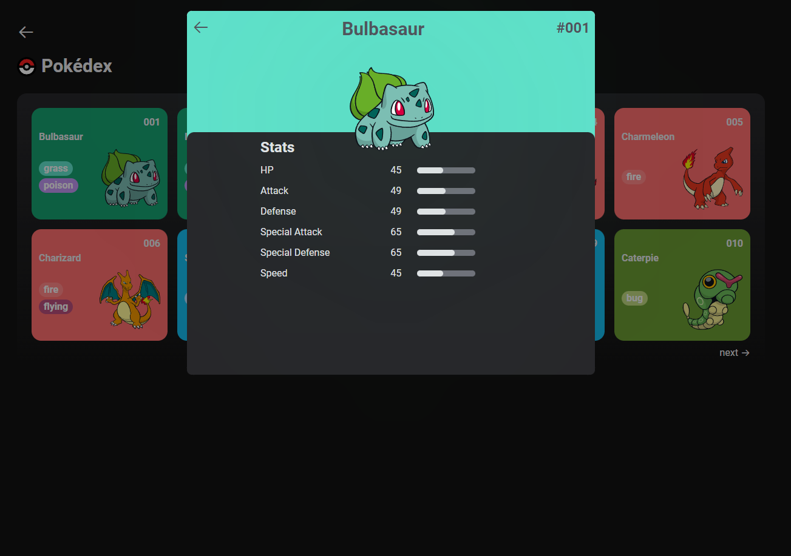
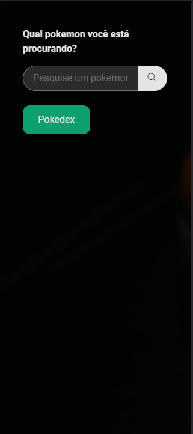
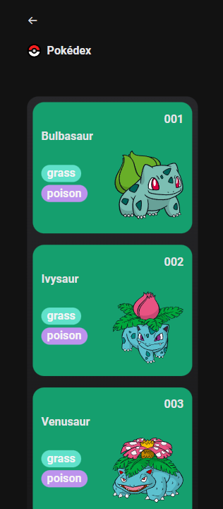
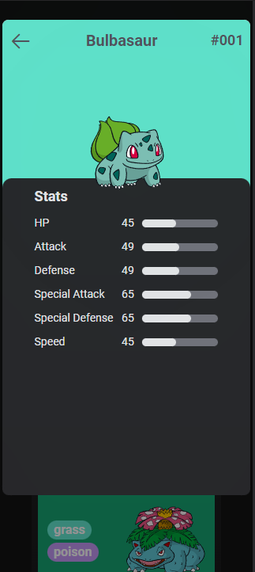

<div align="center">


<h1>Pokédex</h1>


This application was developed during the Bootcamp <spabn>Orange Tech +</span> by [DIO](https://web.dio.me/) and [Banco Inter]().

</div>

<div align="center">

<div align="">
  
  
</div>

[]()
[]()
[]()

</div>

## ▶ Preview

[](https://dio-pokedex-xandowski.vercel.app/)

## 📃 About

Pokedex is an application developed with javascript and tailwindcss using pokeAPI.

## 🛠 Build with

<p align="center">
<a href="https://developer.mozilla.org/en-US/docs/Web/HTML">
    
  </a>
  <a href="https://developer.mozilla.org/en-US/docs/Web/JavaScript">
    
  </a>
  <a href="https://tailwindcss.com/docs/installation">
    
  </a>
  <a href="https://phosphoricons.com/">
    
  </a>
  <a href="https://pokeapi.co/">
    
  </a>
</p>

## 🎞 Demo








## 🎨 Layout

Layout inspirations

- [Dribbble - Nur Asmara](https://dribbble.com/shots/17332968-Pok-dex-Apps-Design-Exploration)
- [Dribbble - Saepul Nahwan](https://dribbble.com/shots/6545819-Pokedex-App)

## 💻 Getting started

```sh
git clone https://github.com/xandowski/dio-pokedex.git && cd dio-pokedex
npm i
```

```sh
npx tailwindcss -i ./assets/css/global.css -o ./dist/styles.css --watch
```

Download [live server](https://marketplace.visualstudio.com/items?itemName=ritwickdey.LiveServer) extension on vscode and run.
